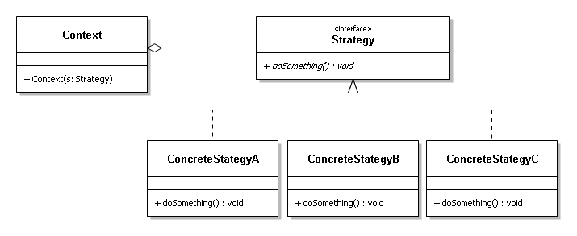

# Plano de Estudo iMasters Certified Professional
### PHP - Boas práticas

A prova de boas práticas em PHP foi completamente baseada em recomendações de boas práticas definidas pela comunidade internacional através das PSRs. Ela exigirá um alto nível de conhecimento destas recomendações.

<table style="width:100%">
  <tr>
    <th>Conteúdo</th>
    <th>Início</th>
    <th>Fim</th>
  </tr>
  <tr>
    <td>Designer Patterns</td>
    <td>06/08/2018</td>
    <td>06/09/2018</td>
  </tr>
  <tr>
    <td>PHP - Avançado</td>
    <td>06/08/2018</td>
    <td>06/10/2018</td>
  </tr>
  <tr>
    <td>PSR's (PHP Standards Recommendations)</td>
    <td>06/09/2018</td>
    <td>06/10/2018</td>
  </tr>
</table>

## Designer Patterns
Design patterns (Padrões de projeto) são soluções já consolidadas no mercado de trabalho de desenvolvimento de software na solução de problemas comuns, essas soluções ja foram usadas e testadas diversas vezes pelas comunidades. Isso as tornam uma poderosa ferramenta no dia-a-dia do programador, pois não é necessário ficar recriando uma solução que já existem (isso é popularmente conhecido na área como __reinventar a roda__).

Os padrões  de projeto **“GoF”** como é conhecido a “Gang of Four”, são dividos em três principais grupos:
* **Padrões Criacionais**: envolvem a criação de instancias de objetos
* **Padrões Estruturais**: permitem que você organize classes ou objetos em estruturas maiores;
* **Padrões Comportamentais**: preocupam-se com a forma como as classes e objetos interagem e com a distribuição de responsabilidades.

<table style="width:100%">
  <tr>
    <th>Criacionais</th>
    <th>Estruturais</th>
    <th colspan="2">Comportamentais</th>
  </tr>
  <tr>
    <td>Abtract Factofy</td>
    <td>Adapter</td>
    <td>Chain of Reponsibility</td>
    <td>Observer</td>
  </tr>
  <tr>
    <td>Builder</td>
    <td>Facade</td>
    <td>Command</td>
    <td>Stade</td>
  </tr>
  <tr>
    <td>Factory Method</td>
    <td>Bridge</td>
    <td>Strategy</td>
    <td>Interprete</td>
  </tr>
  <tr>
    <td>Prototype</td>
    <td>Decorator</td>
    <td>Iterator</td>
    <td>Template Method</td>
  </tr>
  <tr>
    <td>Singleton</td>
    <td>Flyweight</td>
    <td>Mediator</td>
    <td>Visitor</td>
  </tr>
  <tr>
    <td></td>
    <td>Composite</td>
    <td>Memento</td>
    <td></td>
  </tr>
   <tr>
    <td></td>
    <td>Proxy</td>
    <td></td>
    <td></td>
  </tr>
</table>

### Strategy 
É um padrão que pode ser usado quando uma classe tem diversos trechos de código com poucas variações e que possam ser utilizados de forma intercambiável. Em vez de serem colocadas em **if** e **elses**, por exemplo, esses trechos podem ser abstraídos em uma interface e em classes concretas que implementa e encapsula o(s) método(s) dessa interface. Uma vez as classes concretas implementadas elas podem ser usadas em uma classe de contexto faz uma composição com interface das classes concertas. Ou seja, o comportamento da classe de contexto pode ser alterado (fazendo uso do poliformismo) tranquilamente, assim como podemos adicionar outras classes concretas para serem usadas na classe de contexto sem grandes alterações na estrutura como um todo;

### Singleton 
Tem como finalidade limitar a criação de instâncias de uma determinada classe, mas geralmente é usado para criar uma instância única de uma classe da qual poderá ser acessada em qualquer parte do sistema. Essa instância sempre será a mesma, não sendo possível criar novas instância da classe com esse padrão. A classe Singleton deve ter um atributo do seu tipo e esse deve ser estático e privado, essa visibilidade é para não seja possível atribuir valor no atributo de fora da classe Singleton. O único ponto de acesso ao valor do atributo deve ser dentro de um método também estático, tanto que devemos impedir a criação de uma instância da classe com um **new**, isso é feito declarando na classe um método construtor oco e de visibilidade privada. 

### Factory Method

