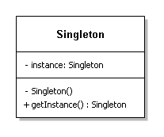

# PHP - Boas práticas

### Plano de estudo.
<table style="width:100%">
  <tr>
    <th>Conteúdo</th>
    <th>Início</th>
    <th>Fim</th>
  </tr>
  <tr>
    <td>Designer Patterns</td>
    <td>06/08/2018</td>
    <td>06/09/2018</td>
  </tr>
  <tr>
    <td>PHP - Avançado</td>
    <td>06/08/2018</td>
    <td>06/10/2018</td>
  </tr>
  <tr>
    <td>PSR's (PHP Standards Recommendations)</td>
    <td>06/09/2018</td>
    <td>06/10/2018</td>
  </tr>
</table>

## Designer Patterns
Design patterns (Padrões de projeto) são soluções já consolidadas na solução de problemas comuns em projetos de desenvolvimento de sofware, essas soluções já foram testadas e consolidadas. 

Os padrões de projeto da **“GoF”** como é conhecido a “Gang of Four”, são dividos em três principais grupos:
* **Padrões Criacionais**: envolvem a criação de instâncias de objetos
* **Padrões Estruturais**: permitem que você organize classes ou objetos em estruturas maiores;
* **Padrões Comportamentais**: preocupam-se com a forma como as classes e objetos interagem e com a distribuição de responsabilidades.

<table style="width:100%">
  <tr>
    <th>Criacionais</th>
    <th>Estruturais</th>
    <th colspan="2">Comportamentais</th>
  </tr>
  <tr>
    <td>Abtract Factory</td>
    <td>Adapter</td>
    <td>Chain of Reponsibility</td>
    <td>Observer</td>
  </tr>
  <tr>
    <td>Builder</td>
    <td>Facade</td>
    <td>Command</td>
    <td>Stade</td>
  </tr>
  <tr>
    <td>Factory Method</td>
    <td>Bridge</td>
    <td>Strategy</td>
    <td>Interprete</td>
  </tr>
  <tr>
    <td>Prototype</td>
    <td>Decorator</td>
    <td>Iterator</td>
    <td>Template Method</td>
  </tr>
  <tr>
    <td>Singleton</td>
    <td>Flyweight</td>
    <td>Mediator</td>
    <td>Visitor</td>
  </tr>
  <tr>
    <td></td>
    <td>Composite</td>
    <td>Memento</td>
    <td></td>
  </tr>
   <tr>
    <td></td>
    <td>Proxy</td>
    <td></td>
    <td></td>
  </tr>
</table>

## Abstract Factory
Fornece uma interface para a criação de famílias de objetos relacionados ou dependentes sem especificar suas classes concretas

## Adapter
Converte a interface de uma classe em outra interface esperada pelos clientes. O Adapter permite que certas classes
trabalhem em conjunto, pois, de outra forma seria impossível por causa de suas interfaces incompatíveis.

## Bridge
Separa uma abstração de sua implementação, de modo que às duas possam variar independentemente.

## Builder
Separa a construção de um objeto complexo de sua representação, de modo que o mesmo processo do remetente de construção possa criar diferentes representações.

## Chain of Responsibility
Evita o acoplamento do remetente de uma solicitação ao seu destinatário, dando a mais de um objeto a chance de tratar a solicitação. Encadeia os objetos receptores e passa a solicitação ao longo da cadeia até que um objeto a trate.

## Command
Encapsula uma solicitação como um objeto, desta forma permitindo que você parametrize clientes com diferentes solicitações, enfileire ou registre (log) solicitações e suporte operações que podem se desfeitas.

## Composite
Compõe objetos em estrutura de árvore para representar hierarquia do tipo partes-todos. O Composite permite que os clientes tratem objetos individuais e composições de objetos de maneira uniforme.

## Decorator
Atribuir indefensabilidades adicionais a um objeto dinamicamente. Os decorators fornecem uma alternativa flexível as subclasses para extensão da funcionalidade.

## Façade (ou Facade)
Fornece uma interface unificada para um conjunto de interfaces em um subsistema. O Façade define uma interface de nível mais alto que torna o subsistema fácil de usar.

## Factory Method
Define uma interface para criar um objeto, mas deixa as subclasses decidirem qual classe postergar (defer) a instanciação às subclasses. 

## Flyweight
Usa compartilhamento para suportar grandes quantidades de objetos, de granularidade fina, de maneira eficiente.

## Interpreter
Dada uma linguagem, define uma representação para a sua gramática juntamente com um interpretador que usa a representação para interpretar sentença nessa linguagem.

## Iterator 
Fornece uma maneira de acessar sequencialmente os elementos de uma agregação de objetos sem expor sua representação subjacente.

## Mediator
Define um objeto que encapsula a forma como um conjunto de objetos interage. O Mediator promove o acoplamento fraco
ao evitar que os objetos se refiram explicitamente uns aos outros, permitindo que você varie suas interações independentemente.

## Memento
Sem violar o encapsulamento, captura e externaliza um estado interno de um objeto, de modo que o mesmo possa posteriormente ser restaurado para este estado.

## Observer
Define uma dependência uma-para-muitos entre objetos, de modo que, quando um objeto muda de estado, todos os seus dependentes são automaticamente notificados e atualizados.

## Prototype
Especifica os tipos de objetos a serem criados usando uma instância prototípica e criar novos objetos copiando esse protótipo.

## Proxy
Fornece um objeto representante ou um marcador de outro objeto para controlar o acesso ao mesmo.

## Singleton 
Garante que uma classe tenha somente uma instância e fornece um ponto global de acesso para ela. 

## State 
Permite que um objeto altere seu comportamento quando seu estado interno muda. O objeto parecerá ter mudado de classe.

## Strategy 
Define uma família de algoritmos encapsula cada um deles e os torna intercambiáveis. O Strategy permite que o algoritmo varie. 

## Template Method 
Define o esqueleto de um algoritmo em uma operação, postergando a definição de alguns passos para as subclasses. O Template Method permite que as subclasses redefinam certos passos de um algoritmo sem mudar sua estrutura.

## Visitor
Representa uma operação a ser executada sobre os elementos da estrutura de um objeto. O visitor permite que você defina uma nova operação sem mudar as classes dos elementos sobre os quais opera.

